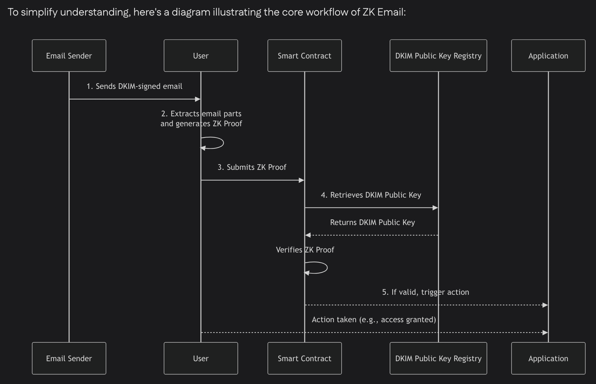
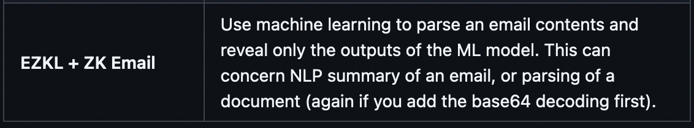

Here we have a flow diagram of the zkEmail protocol:

Note:

It is designed for the protocotl's smart contract to verify the proof.

This should be done with the Aligned service. As the verification gets the DKIM public keys, it will probably mean our generated ZKProof will need to have the DKIM public keys as a pub-input.

Proof generation:
https://docs.zk.email/zk-email-sdk/setup

Create blueprint of zk-email parameter reader:
https://docs.zk.email/zk-email-sdk/create-blueprint

Possible technology to enhance the email interpretation:
